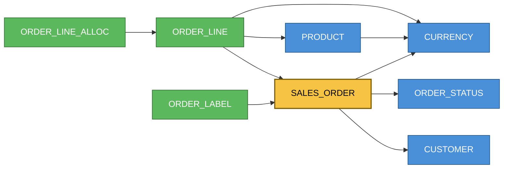

# Context — Database Re-Sync

Glossary for the production→lower-environment database re-sync procedure.

## Terms

### Re-sync

Periodic operation that refreshes a **Target** environment (DEV, TEST, PERF) from the
**Source** environment (production), overwriting Source-originated data while preserving
new data created on the Target since the last re-sync.

### Source

The authoritative environment being copied *from* — production. Source of truth for every
row it contains.

### Target

A lower environment being refreshed *into* (DEV, TEST, PERF). Holds a mix of
Source-originated rows and Target-only rows.

### Target-only row

A row that exists on the Target but has no matching identity on the Source. Interpreted as
data created directly on the Target (e.g. test fixtures). **Preserved** across a re-sync.
Scope of preservation is *inserts only* — edits and deletes of Source-originated rows on
the Target are not preserved. Preservation is judged at the **aggregate-root** grain: see
[[owned child]].

### Owned child
A Value Object whose identity is entirely a parent reference plus discriminators, with no
independent natural key (e.g. `ORDER_LINE` under a `SALES_ORDER`). It **follows its
aggregate root**: within a Source-matched parent the Source child set is authoritative, so Target
children absent from Source are **deleted** (scoped delete-orphan); under a target-only parent the
whole subtree is preserved. Flagged `delete_orphans: true` in the [[identity config]]. (Oracle
`MERGE` cannot delete not-matched-by-source rows, so this runs as a separate `DELETE`.)

### Surrogate key

System-generated primary key (mostly Oracle sequences). Values differ between environments,
so surrogate keys **cannot** be used to match a row across Source and Target.

### Natural identity

The column(s) that define what a row *is*, independent of its surrogate key. Used to match
rows across environments. Each entity is classified by how its identity is formed:

- **Entity Object** — identity is a single natural ID column.
- **Value Object** — identity is a subset of its columns (no standalone natural ID).

A child's identity may **reference its parent** (e.g. `OrderLine` identity = the owning
`Order` plus `line_number`). Because the parent's surrogate key differs across environments,
such a child can only be matched *after* its parent has been remapped — so matching, not just
FK rewriting, must proceed in topological (parent-first) order.

### Aggregate root

The top-level business entity that owns a tree of detail rows. In the sample, `SALES_ORDER`
(natural key `ORDER_NO`, surrogate `ORDER_ID`) is a root. A root typically has one row per code
that mutates in place; where an enforced unique is `(code, VERSION_ID)`, the `VERSION_ID` is a
bumped-in-place counter (see [[version-id]]) and is **excluded** from identity — the code column
alone is the stable key. A root's detail children (order lines, labels) are Value Objects whose
identity grounds out at the root's stable natural key, making every identity
environment-portable. Roots reference shared [[reference table]] rows loaded ahead of them.

### Reference table

A shared lookup/type table (e.g. `CURRENCY`, `ORDER_STATUS`, `*_TYPE`) referenced by many
entities and loaded first in topological order. Its natural identity is its code column
(`*_CD`) by convention, even where no unique constraint enforces it.

### Id-map

Per-entity mapping `Source surrogate key → Target surrogate key`, built while matching that
entity's rows by natural identity. Downstream tables rewrite their foreign-key columns
through the id-maps of the tables they reference.

### Staging schema

A throwaway schema on the **Target** database holding a raw copy of the Source data (carrying
Source surrogate keys), loaded by Data Pump. All matching, id-map building, FK remapping and
`MERGE` into live Target tables run locally against this schema. Dropped after each re-sync.
The extract is the only step that touches Source; it can be a physical dump-file handoff so no
live network path from the lower environment into production is required.

### Identity config

Reviewed YAML file listing, per table: its natural identity columns and its matching mode.
Seeded from Oracle unique constraints, completed by hand where identity is not
constraint-enforced. Central artifact of the re-sync. Each table takes one **matching mode**:

- **natural** — match on a real natural-key column set.
- **value** — match on a column subset that includes a parent reference (Value Object).
- **hash** — match on `STANDARD_HASH` over a canonicalised, audit-excluded column set;
  encoding of Value-Object identity for wide tuples. Scoped to effectively-immutable rows.
- **reload** — `TRUNCATE` + reload verbatim; for Source-owned tables with no Target-only rows.
- **out_of_scope** — left untouched on the Target.

### Version ID

`VERSION_ID` column — a monotonic counter **bumped in place** on every update of a row
(optimistic-lock style, effectively an `updated_at`). Never part of natural identity; always in
the audit-exclude set. Including it would make a row stop matching itself after any edit.

### Hash-identity

Synthetic identity = `STANDARD_HASH(SHA256)` over selected columns. Excludes surrogate key,
audit columns (`UPDATE_ID`, `UPDATE_TMSTMP`, `VERSION_ID`, `*_IND` soft-delete flags) and
per-environment columns; substitutes each foreign key with its parent's natural identity (resolved in
topological order); canonicalises every value before hashing (NULL sentinel, fixed number/date
masks, `TRIM`). A content hash, so any edit to an included column changes identity — under the
stateless model that leaks a stale duplicate, so it is used only for immutable Value rows.

### Out of scope

Objects excluded from the re-sync — isolated tables with no portable identity, tables with an
unresolvable surrogate FK to an excluded table, and views (not base tables). The concrete list
for a given environment is recorded privately in `INSTANCE.md`, never in the public repo.

## Entity graph

Foreign-key dependencies for the synthetic Order/OrderLine sample (`examples/`). An arrow points
from a child to the parent it references, so the graph is processed against the arrows — parents
(reference tables) first, children last. Acyclic, no self-references. The real environment's
graph lives in the private `INSTANCE.md`.

Legend: 🟡 aggregate root · 🔵 reference/type (load first) · 🟢 value object (detail/label).

