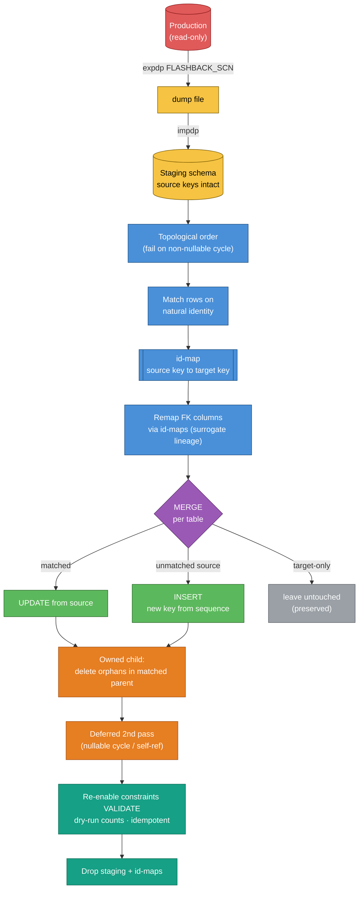
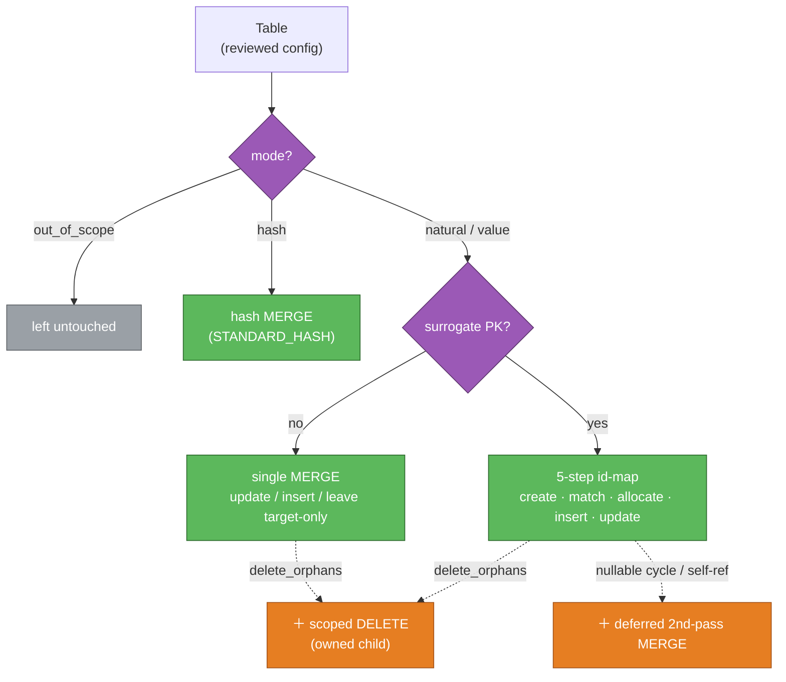

# resync — production → lower-environment database re-sync

Refresh a lower environment (DEV, TEST, PERF) from a production Oracle database **without a plain
copy**: overwrite production-originated data while preserving data created on the target since the
last re-sync. Because surrogate keys differ per environment, this is a **merge keyed on natural
identity**, with foreign-key remapping — not a `dump`/`import`.

> **Status:** engine feature-complete — all matching modes (natural, value, hash), FK
> remapping with surrogate lineage, owned-child delete-orphan, nullable-cycle null-then-update, FK
> constraint disable/re-enable-with-validate, and per-surrogate sequence enforcement. Verified by
> offline unit tests and an end-to-end round-trip integration test against a real Oracle
> (testcontainers / `gvenzl/oracle-free`).

## Why not just copy?

- **Surrogate keys are per-environment.** A row's sequence-generated primary key differs between
  prod and DEV, so rows can't be matched across environments by key, and copied foreign keys point
  at meaningless values.
- **Target-created data must survive.** A straight import would destroy test fixtures and other
  data authored directly in the lower environment.

So the operation matches rows on a **natural key**, builds a `source -> target` id-map per entity,
rewrites foreign keys through it, and merges — updating matched rows, inserting new ones, and
leaving (or, for owned children, reconciling) target-only data.

## How it works

```
extract a consistent source snapshot into a staging schema (Data Pump, source keys intact)
topologically order the entities (parents first; fail on cycle)
for each entity, parents-first:
    match staging rows to target rows on natural identity   -> id-map
    remap foreign-key columns through the parents' id-maps
    MERGE: update matched | insert unmatched (new target keys) | leave target-only
    (owned children: delete Target rows absent from a source-matched parent)
verify referential integrity | preserve target-only data | idempotent
```



### How a table is classified

The pipeline above is the runtime sequence; this is how each table's config selects its SQL shape
(dashed = optional add-on step):



See [DESIGN.md](DESIGN.md) for the full strategy, decisions, and runbook, and
[CONTEXT.md](CONTEXT.md) for the domain glossary.

## Repository layout

| Path | What |
|------|------|
| `extract-schema.sh` | Extract the schema to `catalog.json` with SchemaCrawler. |
| `extract.jq`, `build-config.sh` | Flatten the catalog to `config.skeleton.json`; verify acyclic; print load order. |
| `resync_engine/` | Python engine: model, graph (topo sort), plan (identity + surrogate lineage), sqlgen, runner, CLI. |
| `resync_engine/seed.py` | `seed-config`: draft a `resync.yaml` from the catalog with review markers. |
| `examples/` | Synthetic **Order/OrderLine** sample — the public, proprietary-free worked example. |
| `tests/` | Offline tests (no database). |
| `docs/adr/` | Architecture decision records. |
| `scripts/`, `.githooks/`, `.github/` | Leak guard, pre-commit hook, CI. |

## Quickstart (no database)

```bash
python -m venv .venv && .venv/bin/pip install -e '.[dev]'
.venv/bin/python tests/test_engine.py            # offline tests
.venv/bin/resync print-sql                       # generated SQL for the Order/OrderLine sample
```

Or with [mise](https://mise.jdx.dev): `mise run install`, then `mise run test` / `mise run print-sql`.
Installed as a package the CLI is the `resync` command (equivalently `python -m resync_engine.cli`).

## Using it on a real schema

1. **Extract** the schema (needs DB access):
   ```bash
   DB_HOST=... DB_PORT=1521 DB_SERVICE=... DB_SCHEMA=... DB_USER=... DB_PASSWORD=... ./extract-schema.sh
   ./build-config.sh          # -> config.skeleton.json, verifies acyclic, prints load order
   ```

   `extract-schema.sh` also writes `schema.png` — a slimmed foreign-key diagram (relationship
   columns only). It needs [GraphViz](https://graphviz.org) (`dot`) on the PATH, and is
   gitignored because it carries real identifiers. Set `GRAPH=` to skip it, or `GRAPH=erd.svg`
   for another format.

2. **Draft `resync.yaml`** with `seed-config`, then review it:
   ```bash
   python -m resync_engine.cli seed-config --catalog config.skeleton.json > resync.yaml
   ```
   It seeds the confident classifications and marks judgment calls with `TODO`/`CONFIRM`
   (mutable-in-identity columns, ownership/delete policy, `manual_fks`, sequence names) — the
   generator cannot infer those. Per table pick a matching mode
   (`natural | value | hash | out_of_scope`) and its identity columns. Conventions:
   `*_CD` columns are natural keys; exclude `VERSION_ID`/`UPDATE_*`/`INSERT_*`/`*_IND` audit
   columns; value objects key on parent FK + discriminator (usually the composite PK); flag owned
   children `delete_orphans: true`; declare a `sequence:` per surrogate table. See
   `examples/sample_resync.yaml`.
3. **Dry-run, then apply** (the target should be quiesced; the merge runs in one transaction):
   ```bash
   python -m resync_engine.cli run --catalog config.skeleton.json --config resync.yaml \
       --dsn host:1521/svc --user ... --password ...        # dry-run: per-table counts
   python -m resync_engine.cli run ... --apply              # apply
   ```

Follow the full [runbook](DESIGN.md#runbook) for snapshot, staging, constraint handling, and
verification.

## Keeping a real schema private

The engine is generic; a real schema's identifiers are not. `catalog.json`,
`config.skeleton.json`, `resync.yaml`, `INSTANCE.md`, and `.denylist` are **gitignored** and must
never be committed. A leak guard (`scripts/check-no-proprietary.sh`), a pre-commit hook, and CI
enforce this — see [REPRODUCE.md](REPRODUCE.md) for setup, including continuing the work with
GitHub Copilot in a corporate environment.

## License

Copyright (C) 2026 Eliezio Oliveira.

Licensed under the **GNU Affero General Public License v3.0** — see [LICENSE](LICENSE). AGPL-3.0
is a strong copyleft license: if you run a modified version to offer a network service, you must
make the modified source available to its users. It is provided **without any warranty**; validate
thoroughly before running against any real database.
